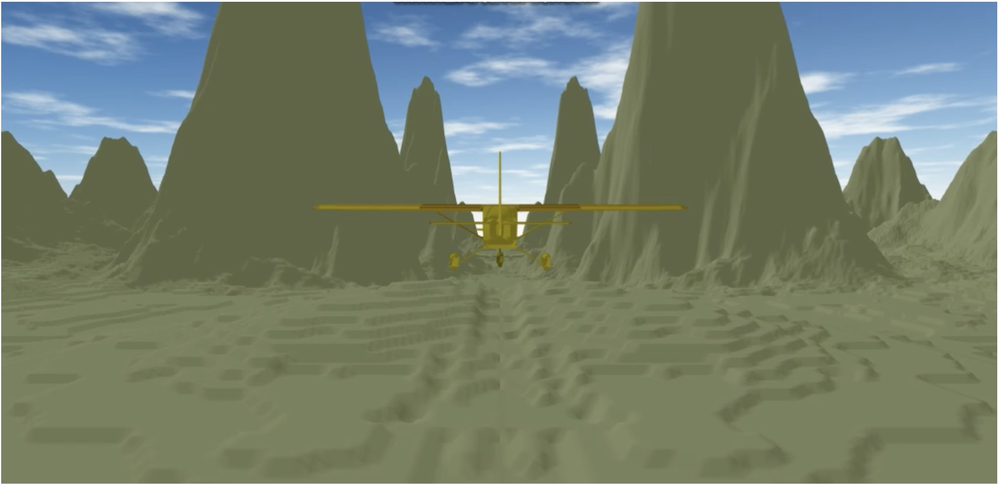
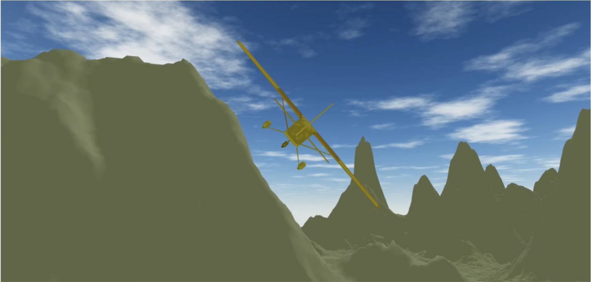

The flight simulator is based on JavaScript/WebGL. As a veteran operator, the player can control the airplane to move in an infinite terrain and avoid crashing into the mountains. It has a simple explosion effect. 

